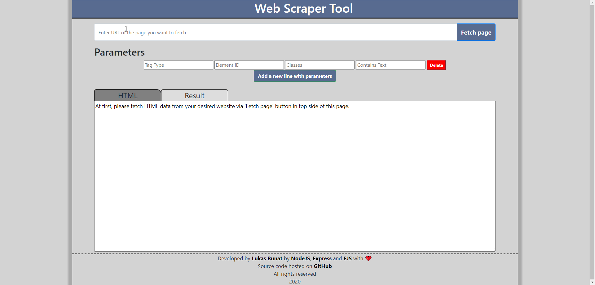

# Web Scrapenator Tool
Web Scrapenator Tool is a web app that allows scraping data from any given website by specifying search parameters.

## How to use
* At first insert URL address into the input area on top of the page
* Fetch data by pressing fetch button
* Fetched data are displayed in the bottom part of the application
* HTML tab is HTML code of the whole website and Result tab for the result from inserted parameters
* By specifying HTML tags, IDs and classes app scrape data accordingly from given URL
* Each following parameter deeper specifics result from given URL
* Every addional line of parameters works with previously selected data (in previous lines)

## Usage demo

## Hosting

## Technolgies
- NodeJS
- Express, Router
- Ejs
- Logic is in vanilla JS
- Cors features

## ToDo
* Result can switch between result with inner/outer HTML
* Testing

## License
