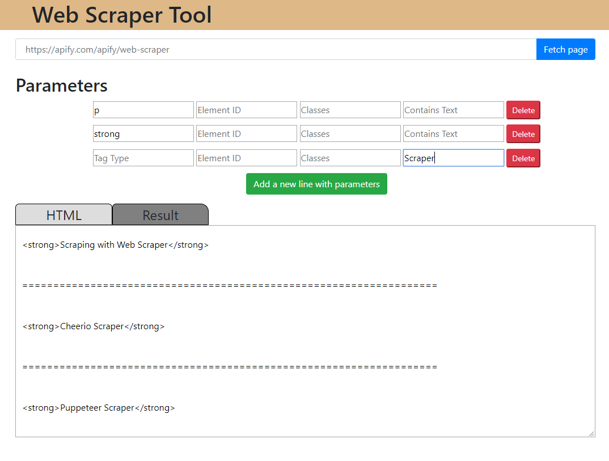

# WebScrapenator

WebScrapenator is a web app that allows scraping data from any given website by specifying parameters.

## How to use
* At first insert URL address into the input area on top of the page
* Fetch data by pressing fetch button
* Fetched data are displayed in the bottom part of the application
* HTML tab is HTML code of the whole website and Result tab for the result from inserted parameters
* By specifying HTML tags, IDs and classes app scrape data accordingly from given URL
* Each following parameter applies more specific selection onto previously selected data (from previous line)

## Example

On website https://apify.com/apify/web-scraper, in any given paragraph,  I want to find all occurrences of the word "Scraper" that are bold

* First I fetch the page https://apify.com/apify/web-scraper by inserting a given URL into URL input box and pressing button fetch
* Now HTML code of fetched page appears in the second half of the page
* So at first I specify a tag "p" to select all paragraphs
* Then on another line I specify a tag "strong" to select all strong tags inside a paragraph
* Finally I search for the term "Scraper"
* Result will give all occurrences, divided by "====" of the word "Scraper"



## Run

```npm
npm start node
npm run dev
```

## ToDo
* Implement command list
* Optimize speed
* Nicer GUI
* Testing


## Contributing
Pull requests are welcome. For major changes, please open an issue first to discuss what you would like to change.

Please make sure to update tests as appropriate.

## License
All rights reserved.